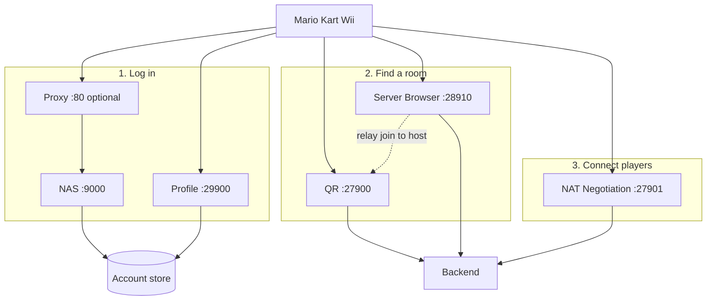

# Architecture

`mkw-dwc` is one Go process that pretends to be Nintendo's old online servers.
A Wii connects to several small services in a fixed order: log in, list rooms,
join a room, then race peer-to-peer.

This page is the map. Linked pages go deeper on each piece.

> [!TIP]
> New here? Read **How online play works**, skim the **Glossary**, then follow
> the **Typical connection flow**. Come back to package details when you need
> them.

## How online play works

A Wii talks to several services in order. Race traffic itself is peer-to-peer
after that.

### NAS
Create or log into a Nintendo Wi-Fi Connection account. The response includes
an auth token and where the other services live.

### Profile (GPCM)
Prove the NAS auth token and open a GameSpy session (profile ID, session
key). Matchmaking expects this login.

### QR
Room hosts send UDP heartbeats so the server knows which rooms are live.
That list is kept in memory.

### Server Browser
Other clients query for rooms over TCP, pick one, and the server can relay a
join message to the host.

### NAT Negotiation
Both sides learn each other's public (and local) addresses so they can punch
through home NATs and open a direct UDP path.

### Race
Gameplay traffic goes Wii-to-Wii. The server only set up the connection.

Shared state behind those services:

- **Account store (database)** - logins, tokens, bans. Survives restarts.
- **Backend** - live rooms and NATNEG entries. Cleared on restart.



## Glossary

Nintendo and GameSpy used dense names. Here is the short version:

| Term | Plain meaning |
|------|----------------|
| **DWC / WFC** | Nintendo Wi-Fi Connection, the old online service |
| **NAS** | Nintendo Authentication Server. First login / account step |
| **Authtoken** | Short-lived token NAS gives the Wii after login |
| **GameSpy** | Third-party stack Nintendo used for profiles and matchmaking |
| **GPCM / Profile** | GameSpy profile login after NAS |
| **QR / Master** | Query and Reporting. Hosts advertise rooms here |
| **Server Browser** | Clients search and join rooms here |
| **NAT / NATNEG** | Helps two devices behind routers find each other (hole punching) |
| **Backend** | In-memory live room list + NATNEG registry (not a network port) |
| **Store / GPCM store** | On-disk account data (`[Store]` in config, JSON files today) |
| **NoSSL** | Client patch so the Wii uses plain HTTP instead of HTTPS to NAS |
| **DNS spoofing** | Pointing `*.nintendowifi.net` at your server so the Wii finds you |

## Network services

| Service | Doc | Port | Proto | Job |
|---------|-----|------|-------|-----|
| NAS | [nas.md](nas.md) | 9000 | TCP HTTP | Account create / login / service location |
| Proxy | [proxy.md](proxy.md) | 80 (optional) | TCP HTTP | Forward Nintendo NAS hostnames to NAS |
| Profile | [profile.md](profile.md) | 29900 | TCP | Prove NAS token, open GameSpy session |
| QR / Master | [qr.md](qr.md) | 27900 | UDP | Hosts advertise rooms (heartbeats) |
| Server Browser | [browser.md](browser.md) | 28910 | TCP | Clients search and join rooms |
| NAT Negotiation | [natneg.md](natneg.md) | 27901 | UDP | Help two players connect through NAT |

## Shared state (not network listeners)

| Component | Doc | Job |
|-----------|-----|-----|
| Backend | [backend.md](backend.md) | In-memory rooms + NATNEG registry |
| Account store | [database.md](database.md) | Players, sessions, NAS tokens (`[Store]` = `json`) |

## Typical connection flow

1. Wii DNS resolves `nintendowifi.net` to your server
2. **Proxy** (if enabled) forwards NAS hostnames to **NAS** on :9000
3. **NAS** creates the account / issues an auth token, returns GameSpy hostnames
4. **Profile** handles GameSpy login and writes a session into the **account store**
5. Host sends **QR** heartbeats, which fill the **backend** room list
6. Clients query the **browser** for rooms (reads the backend)
7. On join, the **browser** relays via **QR**, then **NATNEG** sets up P2P

For hosting and DNS, see [Setup](../setup.md).

---

## For contributors

The sections below are for people reading or changing the code. Skip them if you
only need to run a server.

### Entry point: `main.go`

1. Parses CLI flags (`--config`, `--proxy-bind`)
2. Loads `mkw-dwc.ini` (including required `[Store]`)
3. Initializes logging from optional `[Logging]` via `internal/logging`
4. Opens the account store from `[Store]` Type/Path
5. Creates the shared `backend.Backend`
6. Starts five (or six) services concurrently
7. Shuts down on SIGINT/SIGTERM

The QR server is passed into the browser as a **relay**, so the browser can
forward join messages to hosts over UDP.

### `internal/config`

Loads `mkw-dwc.ini`, an INI file with one section per service:

| Section | Default port | Protocol |
|---------|-------------|----------|
| `NasServer` | 9000 | TCP (HTTP) |
| `GameSpyQRServer` | 27900 | UDP |
| `GameSpyNatNegServer` | 27901 | UDP |
| `GameSpyServerBrowserServer` | 28910 | TCP |
| `GameSpyProfileServer` | 29900 | TCP |

`BindAddr()` reads `IP` and `Port` from each section. `NasSvcHost()` is the
hostname returned during NAS service location (default
`dls1.nintendowifi.net`). `Store()` requires `[Store]` `Type` and `Path`
(`"json"`). `LoggingSettings()` reads optional `[Logging]`.

### `internal/logging`

Central logger. `Init()` runs once from `[Logging]`. Packages call
`logging.For("component")` with names like `nas`, `profile`, `gpsp`, `qr`,
`browser`, `natneg`, `proxy`, `app`. Optional `LogFile` mirrors those lines to a
plain-text file (stderr still gets color when enabled). Optional `DumpFile`
writes verbose raw NAS/proxy TCP dumps to a separate file via `internal/httpfix`.

### Packages at a glance

| Package | Doc | Notes |
|---------|-----|-------|
| `internal/nas` | [NAS](nas.md) | HTTP auth on `:9000` (`/`, `/ac`, `/pr`). Retail needs NoSSL |
| `internal/proxy` | [Proxy](proxy.md) | Optional `--proxy-bind` (usually `:80`) |
| `internal/httpfix` | [Proxy](proxy.md) | Duplicate Host strip + optional raw dumps |
| `internal/database` | [Database](database.md) | `[Store]` JSON account files |
| `internal/backend` | [Backend](backend.md) | In-memory rooms + NATNEG, plus filter expressions |
| `internal/gamespy/profile` | [Profile](profile.md) | TCP `:29900` |
| `internal/gamespy/qr` | [QR](qr.md) | UDP `:27900` |
| `internal/gamespy/browser` | [Browser](browser.md) | TCP `:28910` |
| `internal/gamespy/natneg` | [NATNEG](natneg.md) | UDP `:27901` |

Shared GameSpy helpers in `internal/gamespy/`:

| File | Purpose |
|------|---------|
| `keys.go` | Mario Kart Wii secret (`mariokartwii` -> `9r3Rmy`) |
| `crypto.go` | RC4, challenge/response, login tickets |
| `textwire.go` | Text protocol (`\key\value\final\`) |
| `binwire.go` | Binary helpers (endianness for Wii vs DS) |

### Project layout

```
main.go             Main entrypoint
internal/nas/       Nintendo NAS HTTP server
internal/gamespy/   GameSpy QR, browser, profile, NATNEG
internal/proxy/     Optional NAS reverse proxy
internal/database/  Account store interface + JSON implementation
internal/config/    mkw-dwc.ini loader
internal/logging/   Colored leveled logging
internal/backend/   In-memory rooms and NATNEG registry
tests/              Integration tests (reference parity)
mkw-dwc.ini         Default configuration
docs/               Setup and architecture docs
```

### Tests

Integration tests against the Python `dwc_network_server_emulator` reference:

```shell
go test ./tests/...
```
