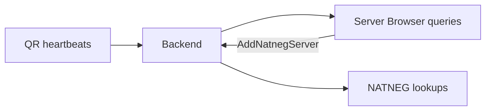

# Backend (in-memory registry)

In-memory registry of live rooms and NATNEG entries. Hosts write via
[QR](qr.md), guests read via the [browser](browser.md), and [NATNEG](natneg.md)
looks up peer addresses here. Restart clears it. Player accounts live in the
[account store](database.md) instead.

Package: `internal/backend`  
Network listener: none (shared library used by QR, browser, NATNEG)

## What it is

`Backend` is the process-wide, thread-safe registry of:

1. **Live rooms** (`serverList`) keyed by game id (`mariokartwii`)
2. **NATNEG entries** (`natnegList`) keyed by cookie / session id

It is not a socket service. Restarting `mkw-dwc` clears all rooms and NATNEG
state. Persistent player data lives in the [account store](database.md) instead.

## Why it exists

[QR](qr.md), [browser](browser.md), and [NATNEG](natneg.md) all need the same
view of "who is hosting" and "who is negotiating". Keeping that in one in-memory
structure avoids a second database for ephemeral matchmaking state.

## Room list

Hosts update rooms through QR:

- `UpdateServerList(gameid, session, fields, console)` merges heartbeat fields
  (`publicip`, `publicport`, `localport`, `localip0`, `natneg`, plus custom keys)
- `DeleteServer` removes a room (explicit leave or QR timeout)
- `FindServers(gameid, filter, fields, maxCount)` applies GameSpy-style filter
  expressions (`filter.go`: comparisons, `AND` / `OR`, `LIKE`, etc.)
- `FindServerByAddress` / `FindServerByLocalAddress` resolve peers for relay and
  NATNEG

## NATNEG registry

- `AddNatnegServer(cookie, serverMap)` records up to 8 distinct public endpoints
  per cookie
- `GetNatnegServer` / `DeleteNatnegServer` for NATNEG session lifecycle

## Who uses it

## Related

- [QR](qr.md) - writes rooms
- [Browser](browser.md) - reads rooms, may write NATNEG entries
- [NATNEG](natneg.md) - reads both maps
- [Architecture](README.md) - full diagram
